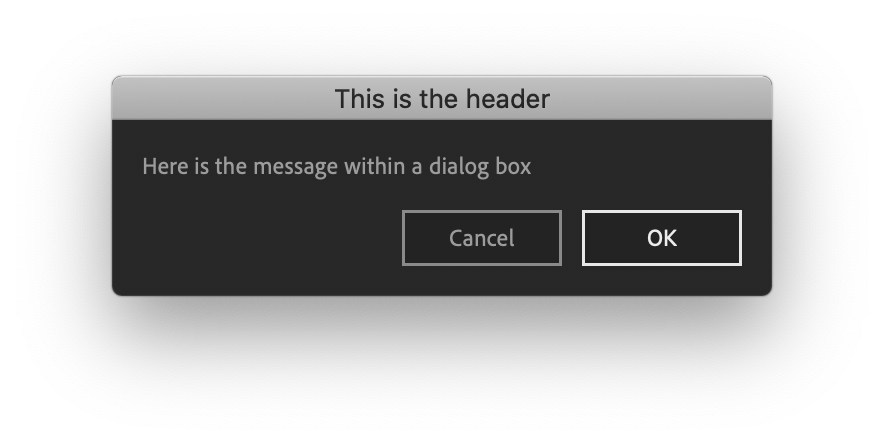
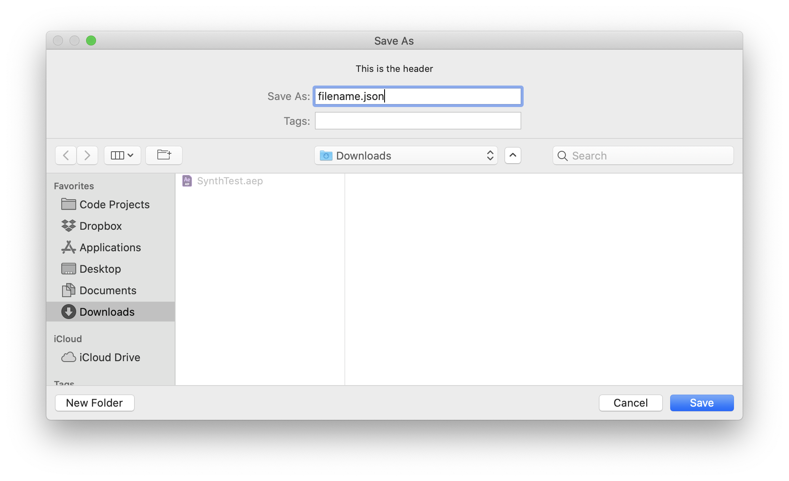
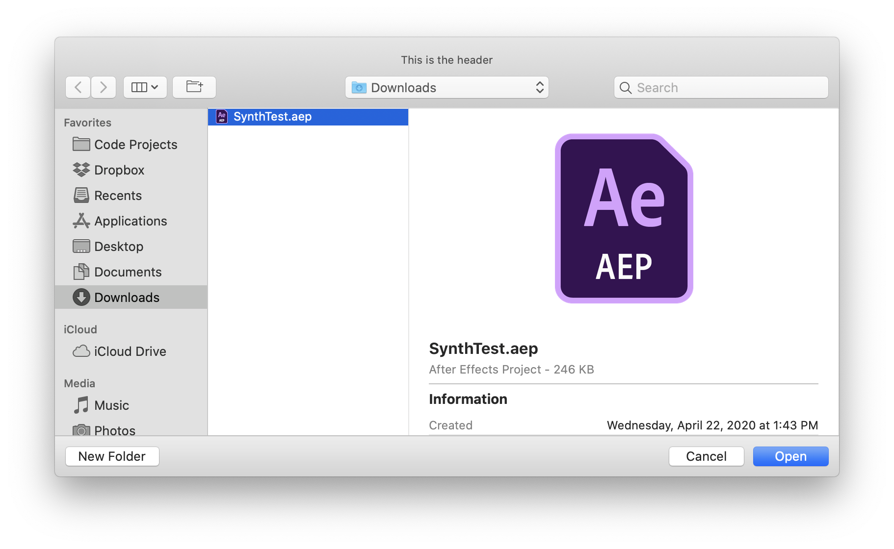

<!-- # API -->

An ongoing collection of utilities used in the manifestation of Adobe panels for [Battle Axe](http://battleaxe.co). This is a work in progress and not advised to use. 

# Quick start
## Installation
Note that you must have node (and npm) installed.
```js
npm install amulets
```

## Import and configure
The global String variables `devName` and `scriptName` are used for preferences and script loading.

**Example**
```js
import amulets from 'amulets'
amulets.configure({
    devName: 'BattleAxe',
    scriptName: 'Timelord'
})
```
### devName
*Type* `String` *Default* `BattleAxe` 
### scriptName
*Type* `String` *Default* `extension name from manifest.xml` 

---

# API
## evalScript
> evalScript(`String`, `Object (optional)` ) : `Promise`

Promisified version of `csInterface.evalScript()` with automatic JSON parsing. Follow [JSX file setup](?id=jsx-file-setup) for encapsulating public jsx methods in and for best results when returning data from the host app.

```js
amulets.evalScript(funcName, params)
.then(ret => {
    console.log(ret)
})
```


## getPrefs
> getPrefs(`Object` | `Array`, `Object (optional)`) : `Promise`

Preference file loading from `Application Support` or folder. 
* [Mac]: "/Users/adamplouff/Library/Application Support/BattleAxe/Timelord/config/prefs.json"
* [Win]: "C:/Users/adamplouff/AppData/Roaming/BattleAxe/Timelord/config/prefs.json"

*Suggested:* Use a `prefs` argument (`Object` or `Array`) to initalize the preference file. A new file will be created if no `prefs.json` file is found. `prefs.json` file properties will take priority over initilaization values. New properties in the prefs argument (not found in `prefs.json`) will be appended to the prefs file. 

*Optional:* `folderName` and `fileName` may be used load different JSON files from different folders.

```js
let prefs = {
    licenseKey: null,
    outputModule: 'Lossless',
}
let options = {
    folderName: 'config',
    fileName: 'prefs', 
}

amulets.getPrefs(prefs, options)
.then(ret => {
    console.log('Prefs loaded:', ret)
})
```


## savePrefs
> savePrefs(`Object` | `Array`, `Object (optional)`) : `Promise`

File saving, similar to [getPrefs](?id=getprefs) file saving to `Application Support` or folder. The save location is set dynamically to `Application Support/devName/scriptName` as defined in [configure](?id=import-and-configure).

* [Mac]: "/Users/adamplouff/Library/Application Support/BattleAxe/Timelord/config/prefs.json"
* [Win]: "C:/Users/adamplouff/AppData/Roaming/BattleAxe/Timelord/config/prefs.json"

*Suggested:* Use a `prefs` argument (`Object` or `Array`) to initalize the preference file. A new file will be created if no `prefs.json` file is found. `prefs.json` file properties will take priority over initilaization values. New properties in the prefs argument (not found in `prefs.json`) will be appended to the prefs file. 

*Optional:* `folderName` and `fileName` may be used save JSON files to different folders. 

```js
let prefs = {
    newComp: true,
    precompGroups: false,
    parametrics: true,
    compScale: 3,
}
let options = {
    folderName: 'config',
    fileName: 'prefs', 
}

amulets.savePrefs(prefs, options)
.then(ret => {
    console.log('Prefs saved:', ret)
})
```

## newServer
> newServer(`integer` between xxx-xxx)

Creates an [express.js](https://expressjs.com/) inside the Adobe host app to listen for [fetch messages](). 

##### /evalScript
The server may be used to run available jsx scripts by name. 

##### /writeFiles
xxxxxxx

```js
amulets.newServer(2780)
```


## reload
Refreshes the panel.
```js
amulets.reload()
```


## popup
> popup(`String`)

Executes a native alert() message with support for linebreak with `\n`.
```js
amulets.popup('Timelord says:\nOpen a new comp')
```


## checkPath
> checkPath(`String`) : `String`

Recursivly creates a folder structure of the entered string then return the same string or log an error if unsuccessful.
```js
let folderPath = '/Users/adamplouff/Desktop/New Folder/'        
amulets.checkPath(folderPath)
// returns '/Users/adamplouff/Desktop/New Folder/'
```


## userPath

Returns the string path to `Application Support/devName/scriptName` as defined in [configure](?id=import-and-configure).
```js
let folderPath = amulets.userPath()
console.log(folderPath)
// returns '/Users/adamplouff/Library/Application\ Support/BattleAxe/Timelord'
```


## confirmDialog
> confirmDialog(`Object (optional)`) : `Promise Boolean`

Creates a 300px wide ScriptUI confirmation dialog with optional string replacment. Clicking **OK** returns `true`, **Cancel** returns `false`. **Return** and **Esc** keys are valid.



```js
amulets.confirmDialog({
    header: 'This is the header',
    msg: 'Here is the message within a dialog box',
    btnConfirm: 'OK',
    btnCancel: 'Cancel'
})
.then(clickedOk => {
    console.log('User clicked OK: ', clickedOk)
})
```


## folderOpenDialog
> folderOpenDialog(`String (optional)`) : `Promise String`

Native *Open Folder* dialog with optional header string.


```js
amulets.folderOpenDialog('This is the header')
.then(folderPath => {
    console.log(folderPath)
})
// return "~/Downloads"
```


## fileSaveDialog
> fileSaveDialog(`String (optional)`) : `Promise Object`

Native *Save File* dialog with optional header string.



```js
amulets.fileSaveDialog('This is the header')
.then(fileObj => {
    console.log(fileObj)
})
// return {
    // ext: "json",
    // name: "filename",
    // path: "~/Downloads",
// }
```

## fileOpenDialog
> fileOpenDialog(`String (optional)`) : `Promise String`

Native *Open File* dialog with optional header string.



```js
amulets.fileOpenDialog('This is the header')
.then(fileObj => {
    console.log(fileObj)
})
// return {
    // ext: "json",
    // name: "filename",
    // path: "~/Downloads",
// }
```


---

# JSX file setup